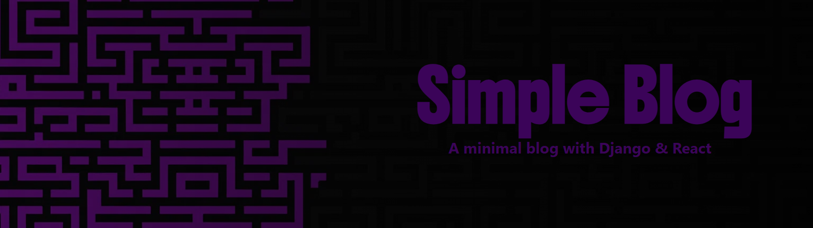
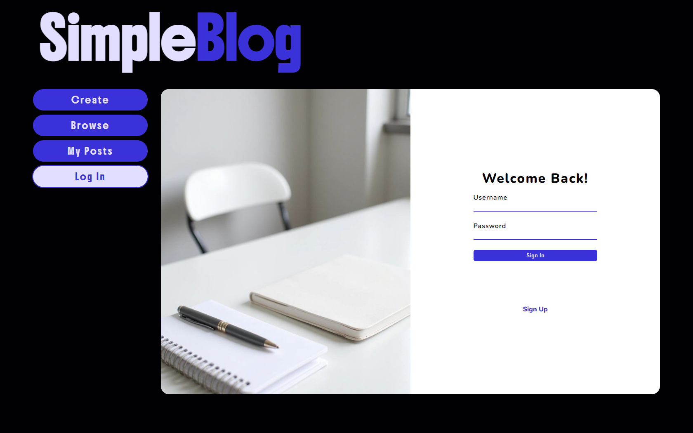
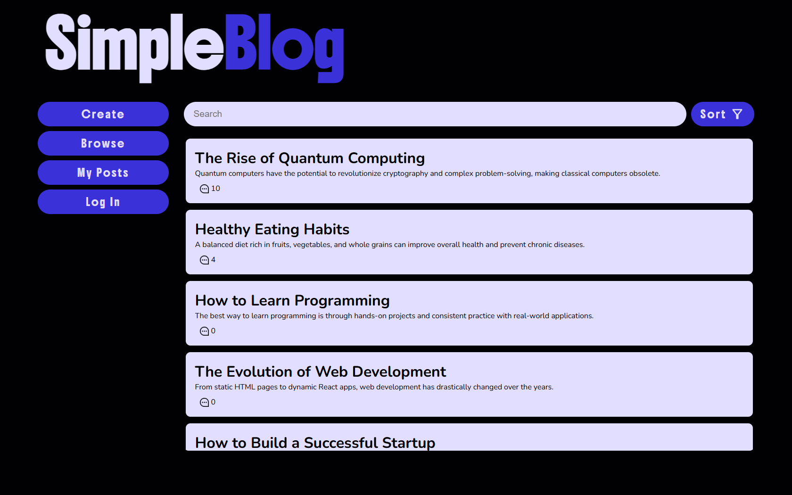
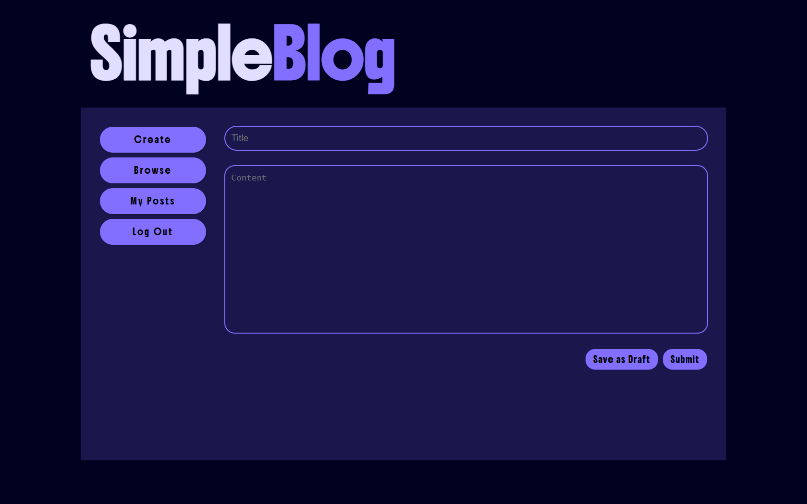

<p align="center">
  
</p>

<h2 align="center">Simple Blog</h2>
<p align="center"><em>A minimal blog built with Django REST & React</em></p>

---

## 📝 Overview

**Simple Blog** is a full-stack blogging application designed for simplicity and clarity.  
It allows users to **create, edit, browse, and manage blog posts** with a clean, modern UI and a robust Django REST backend.

This project was built to demonstrate:
- RESTful API design using **Django REST Framework**
- **React** integration for interactive and responsive frontends
- Authentication and user-based CRUD operations
- Scalable project architecture separating backend and frontend layers

---

## ✨ Features

- 🖊️ **Create, Edit, and Delete** blog posts  
- 📚 **Browse and Search** posts by title or content  
- 🔐 **User Authentication** (login / register / logout)  
- 🧑‍💼 **My Posts Dashboard** to manage authored blogs  
- 💾 **Draft Saving** support for unfinished posts  
- 🌗 **Modern UI** with a dark minimalist theme  
- ⚙️ **Django REST API** backend with token authentication  

---

## 🛠️ Tech Stack

| Layer      | Technology                    |
|------------|-------------------------------|
| Frontend   | React, Axios, TailwindCSS     |
| Backend    | Django, Django REST Framework |
| Auth       | JWT (SimpleJWT)               |
| Database   | SQLite (default)              |

---

## 🖼️ Screenshots

### 🏠 Login Page
<p align="center">
  
</p>

---

### 📰 Browse Page
<p align="center">
  
</p>

> Displays all available blog posts with search and sorting options.

---

### ✍️ Create Post
<p align="center">
  
</p>

> Minimal editor interface for writing new posts or saving drafts.

---

## ⚙️ Installation & Setup

Follow these steps to run **Simple Blog** locally.

---

### 1. Clone the Repository

```bash
git clone https://github.com/<your-username>/simple-blog.git
cd simple-blog
```

---

### 2. Backend Setup

Navigate to the backend directory:

```bash
cd backend
```

Create and activate a virtual environment:

```bash
python -m venv venv
source venv/bin/activate  # On Windows: venv\Scripts\activate
```

Install dependencies:

```bash
pip install -r requirements.txt
```

---

### 3. Configure Environment Variables

Create a `.env` file inside the `backend/` directory:

```bash
touch .env
```

Add the following contents:

```env
# Django Environment
DEBUG=True
SECRET_KEY=your_secret_key_here
ALLOWED_HOSTS=*,localhost,127.0.0.1
```

> **Note:** SQLite is used by default.  
> No additional database setup is required unless you wish to switch to PostgreSQL.

---

### 4. Apply Migrations & Start Backend Server

```bash
python manage.py migrate
python manage.py runserver
```

The backend should now be live at:  
👉 [http://127.0.0.1:8000/](http://127.0.0.1:8000/)

---

### 5. Frontend Setup

Open a new terminal tab/window and navigate to the React frontend:

```bash
cd ../frontend
```

Install dependencies:

```bash
npm install
```

Start the frontend development server:

```bash
npm run dev
```

The frontend should now be live at:  
👉 [http://localhost:5173/](http://localhost:5173/)

